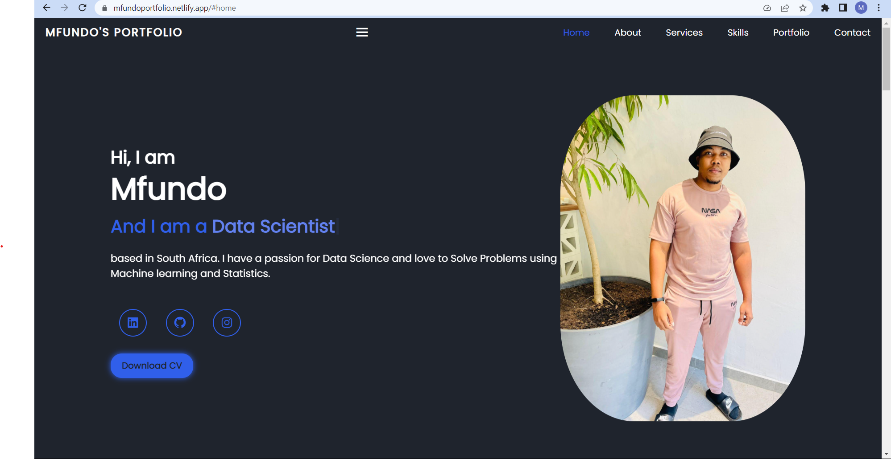

# Welcome to my Portfolio

#### requirements

1.  HTML
2.  CSS
3.  typescript.js

#### Overview setup
 - [x] the index.html file is the main file that is used to render the website
 - [x] the styles.css file is the main file that is used to style the website
 - [x] the script.ts file is the main file that is used to render the website
 - [x] the aboutme.html simply contains the about me section of the website
#### Output of an intro website

#### 

##### Link to the website

https://mfundoportfolio.netlify.app/#

